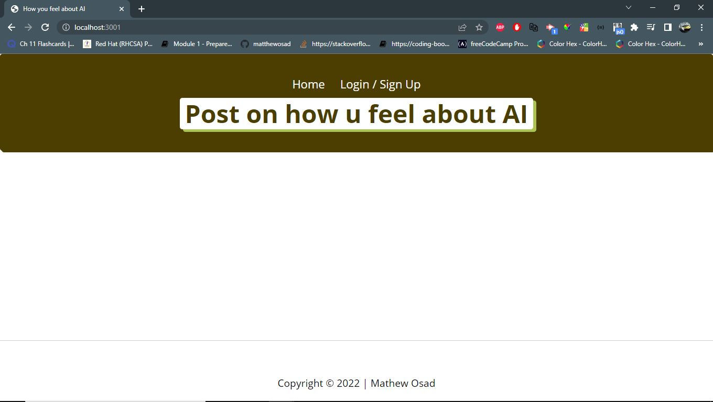

# Tech-blog
## Hi There! 👋🏼

- 💬 My name is Mathew Osadolor, you can call me <b>Matt</b>

## Table of Contents

- [User Story](#userstory)
- [Screen Shots](#screenshots)
- [Installation](#installation)
- [Usage](#usage)
- [Demos](#Demo)
- [License](#license)

## User Story

AS A developer who writes about tech
I WANT a CMS-style blog site
SO THAT I can publish articles, blog posts, and my thoughts and opinions

## Screenshots




## Installation

This project uses npm packages:

```
npm i
```

```
npm start
```

## Usage

To run tests, run the following command:

```

node server.js


```

<br>

The URL of the functional, deployed application.(http://localhost:3001/ )

The URL of the GitHub repository. (https://github.com/mathewosad/Tech-blog)
### Let's Connect!

LinkedIn: <a href="https://www.linkedin.com/in/mathew-osadolor-848b33177/" target="_blank">Mathew Osad</a> | Website: <a href="https://github.com/mathewosad/" target="_blank">Mathew Osad | Portfolio</a> | Email: <a href="mailto:matthewosad@yahoo.com" target="_blank">matthewosad@yahoo.com</a>

<br>

<div>


</div>